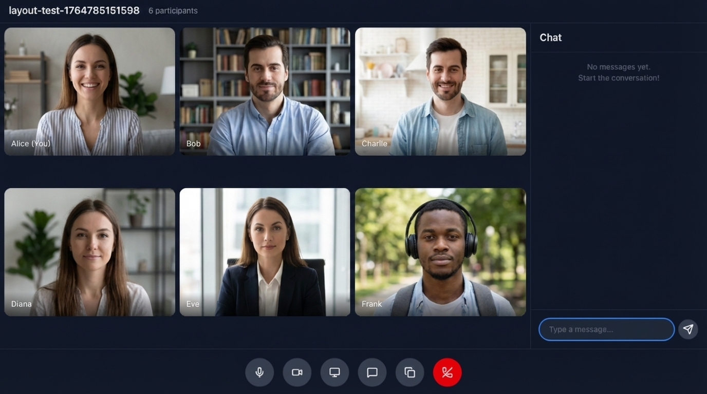
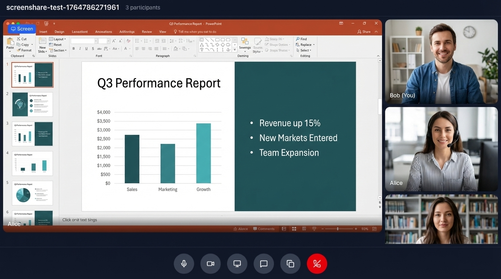

# Expanded Video Call

A full-featured group video calling application using WebRTC mesh topology, React, and TypeScript. Supports up to 6+ participants with screen sharing, real-time chat, and device selection.

## Features

- Multi-party video calls with mesh topology
- Screen sharing with automatic renegotiation
- Real-time P2P chat via WebRTC data channels
- Camera and microphone device selection
- Pre-call lobby with video preview
- Audio/video toggle during calls
- Shareable meeting links
- Responsive video grid layout

## Screenshots

### Group Video Call


### Screen Sharing


## Prerequisites

- Node.js 18+
- npm or yarn

## Setup

1. Install dependencies:

```bash
npm install
```

## Running the Application

1. Start the signaling server:

```bash
npm run server
```

2. In a separate terminal, start the development server:

```bash
npm run dev
```

3. Open http://localhost:5174 in your browser

4. Click "New Meeting" to create a room, or paste a meeting link to join

5. Configure your camera/mic in the lobby, then click "Join"

6. Share the URL with others to invite them

## How It Works

### Architecture

This example uses a **mesh topology** where every participant connects directly to every other participant. Each peer sends and receives media to/from all others.

```
    A ←→ B
    ↕ ╲ ↕
    D ←→ C
```

Mesh topology is ideal for small groups (2-6 participants) because:
- Lowest latency (direct P2P connections)
- No server costs for media relay
- Full quality video between all peers

For larger groups, consider star topology (like the broadcast example) or an SFU.

### Signaling

The signaling server (`server/index.ts`) handles:
- Room management with unique meeting IDs
- Peer join/leave notifications
- Relaying SDP offers/answers between peers
- Forwarding ICE candidates
- Screen share status notifications
- Username updates

### WebRTC Flow

1. User enters lobby, selects devices, previews video
2. User clicks "Join" - connects to signaling server
3. Server sends list of existing peers in the room
4. New peer creates RTCPeerConnection for each existing peer
5. SDP offer/answer exchange establishes connections
6. ICE candidates exchanged for NAT traversal
7. Media streams and data channels flow directly between peers

### Screen Sharing

Screen sharing uses WebRTC renegotiation:
1. User clicks "Share Screen" - browser prompts for screen selection
2. Screen track is added to all existing peer connections
3. New SDP offers are created and sent to each peer
4. Peers receive the new track and display it separately
5. When sharing stops, tracks are removed and connections renegotiate again

### P2P Chat

Chat messages are sent via WebRTC data channels:
- No server relay needed - messages go directly between peers
- The initiating peer creates the data channel
- Receiving peers get notified via `ondatachannel` event
- Messages are JSON-encoded `ChatMessage` objects

### Project Structure

```
expanded-video-call/
├── server/
│   └── index.ts              # WebSocket signaling server
├── src/
│   ├── components/
│   │   ├── Home.tsx              # Landing page
│   │   ├── Lobby.tsx             # Pre-call device setup
│   │   ├── CallScreen.tsx        # Main call UI
│   │   ├── VideoGrid.tsx         # Responsive video layout
│   │   ├── VideoTile.tsx         # Individual video display
│   │   ├── VideoPreview.tsx      # Lobby video preview
│   │   ├── Controls.tsx          # Call control buttons
│   │   ├── Chat.tsx              # Chat panel
│   │   └── DeviceSelector.tsx    # Camera/mic dropdowns
│   ├── hooks/
│   │   ├── useWebRTC.ts          # Peer connections & data channels
│   │   ├── useSignaling.ts       # WebSocket signaling
│   │   ├── useMediaStream.ts     # Camera/mic access
│   │   ├── useMediaDevices.ts    # Device enumeration
│   │   ├── useScreenShare.ts     # Screen capture
│   │   └── useChat.ts            # Chat message handling
│   ├── utils/
│   │   ├── routing.ts            # URL routing helpers
│   │   └── turnCredentials.ts    # TURN credential fetching
│   ├── types.ts                  # TypeScript interfaces
│   ├── App.tsx                   # Main application
│   └── main.tsx                  # Entry point
└── package.json
```

## Message Protocol

### Client → Server Messages
| Message | Description |
|---------|-------------|
| `join` | Join a room with peerId, roomId, username |
| `offer` | SDP offer to a specific peer |
| `answer` | SDP answer to a specific peer |
| `ice-candidate` | ICE candidate to a specific peer |
| `screen-share-started` | Notify peers of screen share |
| `screen-share-stopped` | Notify peers screen share ended |
| `username-update` | Update display name |

### Server → Client Messages
| Message | Description |
|---------|-------------|
| `room-peers` | List of existing peers when joining |
| `peer-joined` | New peer joined the room |
| `peer-left` | Peer left the room |
| `offer` | Forwarded SDP offer from peer |
| `answer` | Forwarded SDP answer from peer |
| `ice-candidate` | Forwarded ICE candidate |
| `screen-share-started` | Peer started screen sharing |
| `screen-share-stopped` | Peer stopped screen sharing |
| `username-update` | Peer changed their username |

## TURN Server

This example uses [Metered STUN Server](https://www.metered.ca/stun-turn/) for ICE connectivity:

For production with users behind restrictive NATs, add TURN credentials from your Metered dashboard:

```javascript
const response = await fetch(
  "https://<appname>.metered.live/api/v1/turn/credentials?apiKey=<API_KEY>"
);
const iceServers = await response.json();
```

## Comparison with Other Examples

| Feature | group-video-call | expanded-video-call | broadcast |
|---------|-----------------|---------------------|-----------|
| Topology | Mesh | Mesh | Star |
| Tech Stack | HTML/CSS/JS | React, TypeScript | React, TypeScript |
| Participants | 2-4 | 2-6+ | 1 broadcaster + many |
| Screen Share | No | Yes | No |
| Chat | No | Yes (P2P) | Yes (Server) |
| Device Selection | No | Yes | Yes (Broadcaster) |
| Lobby | Basic | Full preview | Yes |
| Use Case | Simple calls | Team meetings | Live streaming |

## Key Implementation Details

### Late Joiner Screen Share

When a new peer joins while another is screen sharing:
1. Server notifies new peer about active screen shares via `isScreenSharing` flag
2. New peer creates connection to screen sharer
3. Screen sharer renegotiates to add screen track to new connection

### Connection State Handling

```javascript
pc.onconnectionstatechange = () => {
  if (pc.connectionState === 'failed') {
    pc.restartIce(); // Attempt ICE restart
  }
};
```

### ICE Candidate Queuing

ICE candidates that arrive before remote description is set are queued:
```javascript
if (!pc.remoteDescription) {
  pendingCandidates.push(candidate);
  return;
}
await pc.addIceCandidate(candidate);
```

## Limitations

- Mesh topology limits practical group size to ~6 participants
- No recording functionality
- Chat history lost on page refresh
- No reconnection handling for dropped connections

## Building for Production

```bash
npm run build
```

The built files will be in the `dist/` directory.

## E2E Tests

Run the expanded-video-call specific tests:

```bash
cd ../../e2e
TEST_EXAMPLE=expanded-video-call npm test
```

Tests verify:
- Two peers can establish video connection
- Multiple peers receive each other's streams
- Screen sharing works correctly
- Chat messages are delivered via data channels
- Late joiners receive existing screen shares
- Peer disconnection is handled properly
